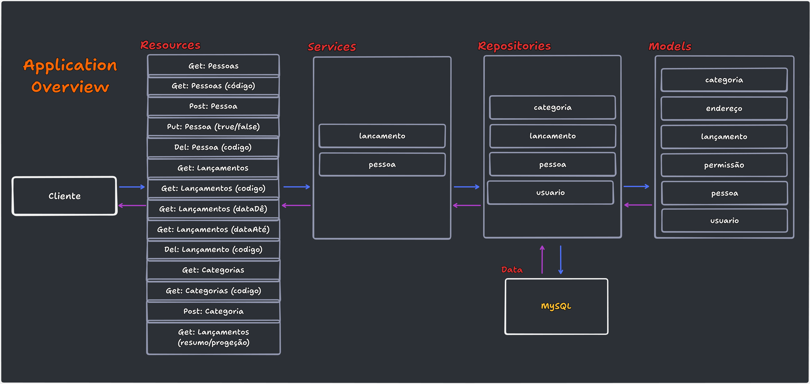
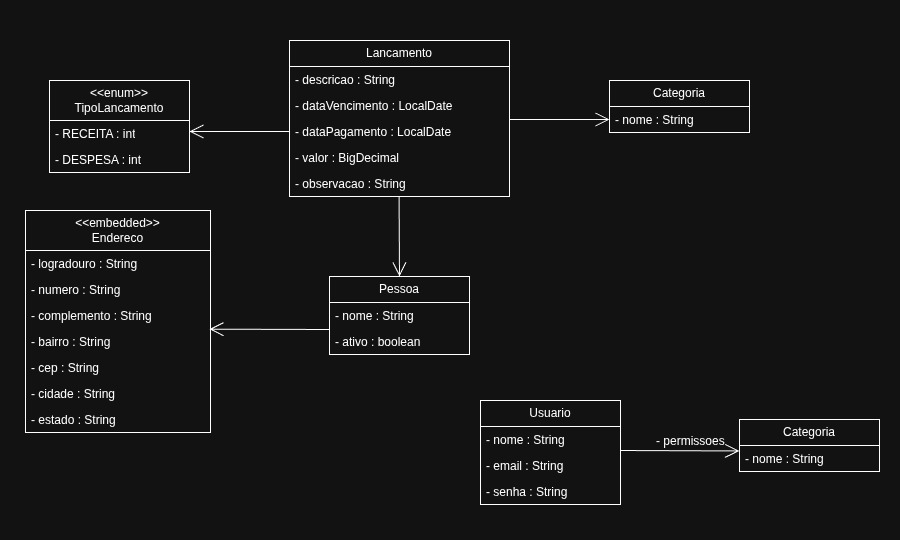

  

 
 

#### Descrição
- Aplicação Rest Fullstack que possui uma API SpringBoot e uma SPA Angular com recursos para cadastro e visualização de operações financeiras referentes a receitas e despesas do usuário.

#### Domínio
- Lançamentos de receitas e despesas.  

#### Diagrama de Classes

  

#### Tecnologias
- Java [17]
- TypeScript [4.7.2]
- Angular [14.2.3]
- PrimeNG [14.0.0]
- SpringBoot [2.7.3]
- Spring Security
- Oauth2
- Hibernate 
- Mysql [8.0]
- Flyway

#### Author: Me [LinkedIn](https://www.linkedin.com/in/andrp) 

