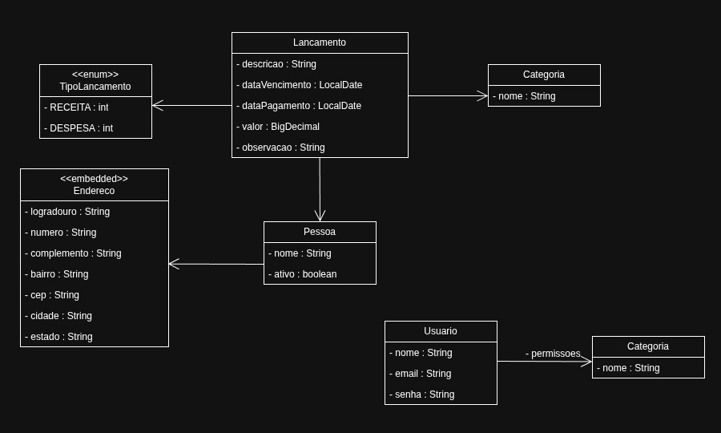
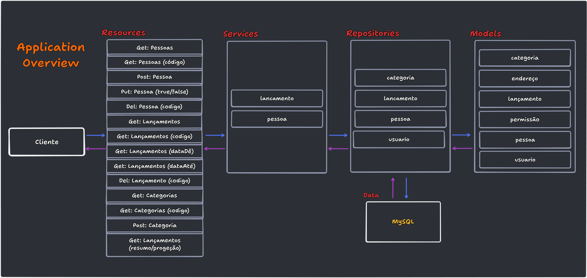

<h1 align="center">Grana Application</h1>

 

  

 

#### UML Class Diagram

  

 

#### Description
**Grana** is a fullstack solution for personal financial management, designed to provide predictability, organization, and assertive decision-making for everyday finances. 

The application addresses the challenge of budget disorganization by centralizing the management of income and expenses within a modern web interface (Angular), supported by a secure and scalable REST API (Spring Boot, OAuth2, and JWT). 
With it, users can monitor payables and receivables, track due dates and settlement statuses, classify expenses by category, and generate analytical reports that reveal the health of their financial assets.

#### Domain
The domain is **Personal Financial Management (Financial Control)**:
- **Financial Postings (Transactions)**: Core business module responsible for modeling the lifecycle of financial transactions (classified as *Income* and *Expenses*), managing values, due dates, payment/receipt dates, and status tracking.
- **Budgetary Categorization**: Mechanism for organizing financial movements into categories to enable budget planning.
- **Persons (Payees and Payers)**: Entities linked to financial postings that represent the origin or destination of financial resources.
- **Analytical Insights and Reporting**: Consolidation of transaction data for statistical summaries, cash flow tracking, and analytical reports supporting sound financial decision-making.

#### Overview

  

  

http://grana-application.umbrella.com
  <select>
    <option value="/lancamentos">/lancamentos</option>
    <option value="/pessoas">/pessoas</option>
    <option value="/categorias">/categorias</option>
    <option value="pessoas/nome">/pessoas?nome=...</option>
    <option value="pessoas/codigo">/pessoas/{codigo}</option>
    <option value="pessoas/codigo/ativo">/pessoas/{codigo}/ativo</option>
    <option value="lancamentos resumo">/lancamentos?resumo=true</option>
    <option value="...">...</option>
  </select>

  

#### Technologies

##### Frontend
- Angular [14.2.3]
- TypeScript [4.7.2]
- Node [16.10.0]
- PrimeNG [14.0.0]
- PrimeFlex [3.2.1]
- PrimeIcons [5.0.0]
- Chart.js [3.6.0]
- @auth0/angular-jwt [5.2.0]
- @ngx-translate/core [14.0.0]
- RxJS [7.8.0]
- Font Awesome [4.7.0]

##### Backend
- Java [11]
- Spring Boot [2.7.3]
- Spring Data JPA (Hibernate)
- Spring Security
- Spring Authorization Server [0.2.3]
- Spring OAuth2 Resource Server
- Spring Security JWT [1.1.1.RELEASE]
- MySQL [8.0]
- Flyway [8.5.13]
- JasperReports [6.21.4]
- AWS Java SDK (S3) [1.11.670]
- Spring Boot Starter Mail
- Thymeleaf
- Hibernate Validator
- Apache Commons Lang 3

#### Author: Me [LinkedIn](https://www.linkedin.com/in/andrp) 

